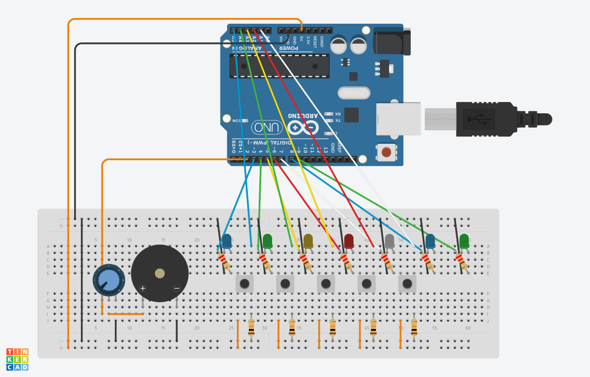
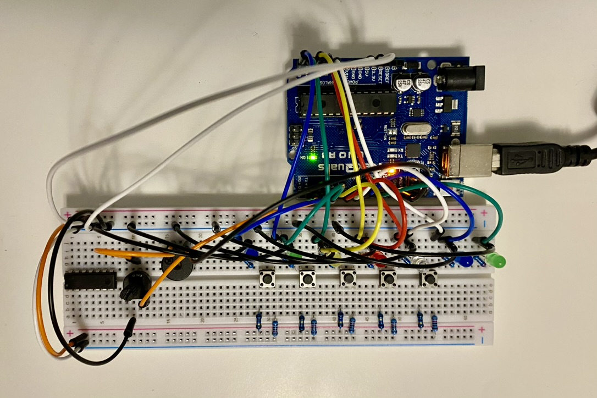

# Simon Astley

Watch the demo:

## What it Does

My project mimics the old electronic handheld game Simon, where a series of lights and sounds will play and the user has to copy the pattern by pressing the same buttons. It starts one button at a time, then adds one each time the user gets it right. My project does the same thing, but only has one pre-programmed sequence of four light-sound-button combos, which play the first four notes of the chorus to Rick Astley’s *Never Gonna Give You Up*. Getting the sequence correct will reward you with the rest of the chorus.
Inspiration for this project came from my own head, a comment made in class by the one and only Professor Allred, and [this](https://bit.ly/3hmnOjf).

## How it Works

Five buttons are connected to the five analog inputs on the Arduino, and 7 LEDs are connected to digital pins as inputs as well.  The software has 5 states: `PLAY`, `USER_INPUT`, `CHECK`, `PASS`, and `FAIL`. During `PLAY`, the pattern will play a tone and light a corresponding LED for each note in the sequence, increasing the length each time. During `USER_INPUT`, the user can press the buttons that correspond with the LEDs that lit up to copy the pattern. After `USER_INPUT`, `CHECK` will determine if they got the pattern right, then send control back to:

- `PLAY` (if there’s more sequence left), or
- `FAIL` (if they got it wrong), or
- `PASS` (if they got the whole sequence correct).

`PASS` will then call `playRick()` which will totally rick roll the user. lol gottem

## Wiring Diagram

There's definitely ways to simplify this, but I didn't get around to them - such as wiring the LED resistors directly to ground from the cathode instead of between the anode and digital out.

## Photo

Also I didn't feel like making short jumper wires for the buttons' connections to +5V so I just used super weak 10ohm resistors.

## Issues

Most of the problems I encountered in this fell into one of two categories:

- Software logic
- Arduino output

I did not realize that you have to setup the pins with a call to `pinMode()`, so I was getting strange low voltages and unpredictable behavior on the LEDs for a while. Once I found the `pinMode()` problem it was an easy fix.

Otherwise the only other types of issues I had were just in debugging my own code. I accidentally wrote in a memory leak at one point, and I had problems getting a switch case to be caught (still boggled about that one). Otherwise, this project was pretty straightforward and easy to get done.

## Future Improvements

If given more time, I would spend some time refactoring the code to make it a bit more robust, adaptable, and configurable. I’d use the Button class in combination with a Sequence or Melody class to
make it possible to have more than one song played. Right now it’s pretty rigid.

I’d also add more buttons to actually be able to play all seven (or more) notes, but my kit only came with five.
